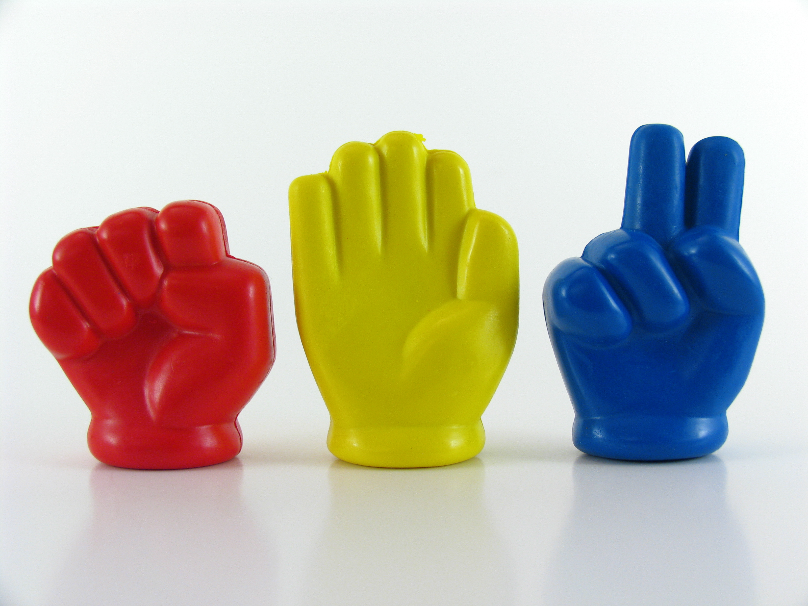

#  Rock, Paper, Scissors in Java

## Overview

This is a basic version of rock–paper–scissors that allows users to play against the computer in the console. 
The game consists of a few main features:

- Start the game
- Play rock–paper–scissors against a computer player.
- Play rock–paper–scissors against a human player.
- Select your token
- Display the history of all your games with date, result and who was your opponent
- Quit the game

This project helps me learn more about passing data using file while implementing the history.
Random number generator is useful to handle playing with the computer.
Overall, I have learned more about Java OOP and some good practice.

